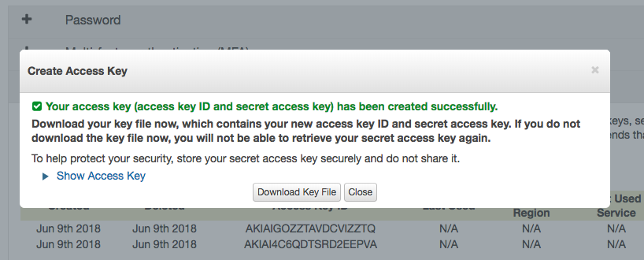

# Lambda in minutes

Create and Deploy Lambda Functions in few minutes

## Setup

First you need to install serverless:

```
npm install -g serverless
```

Create a directory folder for your template

```
mkdir lambda-minutes
```

Setup the serverless template for node.js

```
serverless create -t aws-nodejs
```

Clean up the boilerplate config from the `serverless.yml` and copy the simple config below: (Sydney region)

```
service: lambda-minutes

provider:
  name: aws
  runtime: nodejs6.10
  stage: dev
  region: ap-southeast-2

functions:
  hello:
    handler: handler.hello
    events:
     - http:
         path: /
         method: get
```

## Deployment

There are better ways to setup security, like creating `IAM User` with limited permissions, but for this example, we will get the key and secret from security credentials.

Login to AWS => My Security Credentials



Copy the `Access Key` and `Secret Access key` and setup the following:

```
serverless config credentials --provider aws --key xxx --secret xxxx
```

Add the flag `-o` to override if you want to replace your existing credentials.

Deploy your lambda function in dev environment

```
serverless deploy
```

Deploy your lambda function in production

```
serverless deploy --stage production
```

## License

MIT
